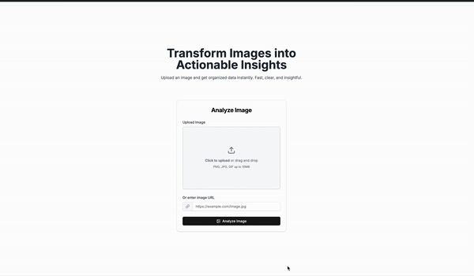

# Advision

## Introduction

ADVision is a REST service capable of converting a given image into detailed marketing suggestions. This tool leverages advanced image recognition powered by the OpenAI API to analyze visual content and provide actionable insights for marketing strategies.
As of now, You can try it on [the website](https://ad-vision-site.vercel.app/).

## How it works

It uses the OpenAI API to analyze the content of Query parameter and generates a detailed report with marketing suggestions. The service is capable of identifying objects, people, and other elements in the image, and provides recommendations on how to leverage this information for marketing purposes.

## Example



### Response

```json
{
  "advertisement": "Explore the breathtaking beauty of Canada with our exclusive travel packages! Discover the vibrant city of Vancouver, where stunning mountain views meet an energetic urban atmosphere. Book your adventure today and immerse yourself in the culture, cuisine, and natural wonders that this incredible destination has to offer. Don't just visit, experience Canada like never before!",
  "call_to_action": "Book Your Canadian Adventure Now!",
  "alt_text": "A vibrant image of Vancouver, Canada, with the Canadian flag in the foreground.",
  "product_suggestions": [
    "Vancouver city tours",
    "Nature excursion packages",
    "Culinary experience sessions",
    "Adventure gear rentals"
  ],
  "target_audience_insights": "Target travelers aged 25-45 who are interested in nature, culture, and unique experiences.",
  "emotional_tone_analysis": "Inspiring and adventurous; evokes a sense of exploration and appreciation for nature.",
  "seo_keywords": [
    "Vancouver travel packages",
    "Canadian adventure tours",
    "Discover Vancouver",
    "Explore Canada",
    "Vancouver experiences"
  ],
  "social_media_caption": "Unleash your wanderlust and discover the beauty of Vancouver—where adventure awaits!",
  "content_ideas": [
    "Feature local attractions and activities in Vancouver",
    "Highlight multicultural cuisines available in the city",
    "Promote seasonal events and festivals in Vancouver"
  ],
  "hashtags": [
    "#ExploreCanada",
    "#VancouverTravel",
    "#CanadianAdventures",
    "#TravelGoals",
    "#NatureLovers"
  ],
  "marketing_strategy_tips": "Leverage social media to showcase user-generated content from travelers; partner with influencers to increase reach.",
  "image_enhancement_suggestions": "Consider adding overlays for promotional text or a filter to enhance colors that reflect the lively atmosphere of the city.",
  "cultural_adaptations": "Ensure promotional materials respect local customs and values, emphasizing Canada's multiculturalism.",
  "legal_ethical_considerations": "Ensure all travel packages comply with current regulations and are ethically marketed to avoid misleading information.",
  "emojis": ["🇨🇦", "🏔️", "🌆", "🛶"]
}
```

## Usage

The root endpoint `/` redirects to a swagger documentation page where you can test the API.

## Installation

You can run the api locally the way you'd do it with any go project.

```bash
go mod download

```

Create a .env file in the root directory and add the following variables:

```bash
OPENAI_API_KEY= # your_openai_api_key
ENVIRONMENT= # 'prod' or 'dev'
```

Then you can run the server with:

```bash
# install swaggo globally to generate swagger documentation on build
go install github.com/swaggo/swag/cmd/swag

# If building to prod(strips debug symbols)
make build-prod
# else you can use
make build

# run the server
make run
```

### Tools used

- Go 1.23.0
- [Gin](github.com/gin-gonic/gin) (Routing)
- [Swaggo](github.com/swaggo/swag) (Swagger Documentation)
- [go-openai](github.com/sashabaranov/go-openai) (Wrapper over the OpenAI API)

### Implementation Status

- [ ] Regenerate specific field suggestions
- [ ] Persist suggestions generation in a database
- [ ] Implement limiter
- [ ] Improve prompting
- [ ] Tune Model with datasets to generate accurate suggestions
- [ ] Improve Logging system

## License

This project is licensed under the MIT License - see the [LICENSE](LICENSE.txt) file for details.
